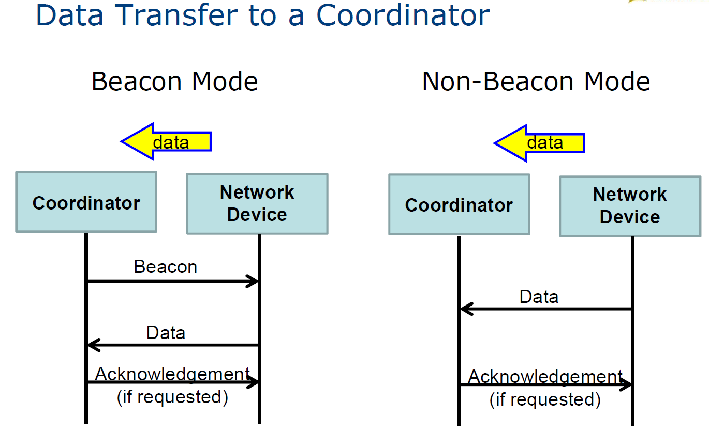

# Lecture 1 Introduction
## Wireless Sensor Network (WSN)
* Consist of one or more sensors, could be different type of sensors (or actuators)
* In wireless sensor networks (WSNs), all the data collected by the sensor nodes are forwarded to a sink node


## Internet of Things
Extending the current Internet and providing connection, communication, and inter-networking between devices and physical objects, or "Things"


## Network
* Managing nodes (discovery, join, leave, etc).
* Relaying data packets from the source to the destination node in the network.


---

# Lecture 2 System Overview
## Cyber-Physical Systems (CPS)

## IoT System Architecture

## Smart Devices
* with sensors/actuators/tag
* with some processing power
* with communication capability

Roles:
* Data collecting point
* Human interaction point
* Data processing point
* Information storage point
## IoT Devices
Sensor Node (Mote)
* powered by battery
* small in size and low in cost
* doesn’t usually perform complicated tasks
* Power consumption is the main design issue

## IoT Gateway
connects IoT devices and the Internet
Roles:
* Managing machine-to-machine connections
* Translating protocols
* Processing data
encrypting/decrypting, filtering, consolidating data
(Data consolidation refers to the collection and integration of data from multiple sources into a single destination.)
* Creating a boundary between the Internet and local networks for increased security
## Real Time Computing
A late answer is a wrong answer
* Logical requirements -- correct answer
* Temporal reqirements -- within the correct time window
* Classification:
    * Hard/Soft Time Constraints
    system fails/degrades when meet deadline
    no ideal hard real-time system
* Workload characteristics:
Periodic/Aperiodic tasks
* Scheduling:
    * Preemptive and Non-preemptive
    * Static and Dynamic
    * Online and Offline
    offline:The outcome can be stored in a table for execution later.
    * Optimal and Heuristic
    heuristic: An algorithm is said to be heuristic if there is no formal proof that its produced result is optimal.
* Design:
Data Flow/Control Flow/State Transition Diagrams
## Finite State Machine
A finite state machine is a representation of an event-driven (reactive) system. In an event-driven system, the system makes a transition from one state (mode) to another, if the condition defining the change is true.


### Mealy FSM 

State-Transition Diagram:


State transition table


* Mealy machines are finite state machines in which transitions occur on clock edges. The output of a Mealy chart is a function of inputs and state

* Moore machines are finite state machines in which output is modified at clock edges. The output of a Moore chart is a function only of state

* Stateflow


## Distributed real-time system
A multi-domain IoT application (e.g. smart city) is often a distributed real-time system:
* Connect various single domain IoT applications
* Add another dimension into the system: communication
* Not just to pay attention to timeliness of results, but also accuracy of communication among domains


---

# Lecture 3 Hardware Platform
## Sensors
* Passive, omnidirectional (e.g. mic)
* Passive, narrow-beam sensor (e.g. PIR, passive infrared)
* Active sensors (e.g. sonar, radar, etc.)

Transfer Function
* Resolution
* Accuracy
* Precision or Repeatability


Sensor Technology
* Capacitive
For detection of displacement, humidity,
acceleration, human contact
* Resistive
For detection of light, force, heat, etc.
* Magnetic (passive)
Hall effect sensor, magneto-diode, magneto-transistor
For measuring of rotary movement, Earth's magnetic
field, etc.
* Inductive (active)
For detection of metallic object and different metals
* Thermoelectric
For measurement of temperature
* Pyroelecytic
Common in PIR (Passive InfraRed) sensors
For human/animal motion detection, flame detection,
NDIR (Non Dispersive IR) gas analysis, etc
* Sound Level
inductive (dynamic microphone) and capacitive (condenser microphone)
* Electromechanical Sensors
Fluid flow measurement (e.g. mechanical flow meters),
Microelectromechanical systems (e.g. MEMS gyroscopes), etc.
* Electrochemical Sensors
CO detector, pH meter, etc.

## Actuator
* Hydraulic
* Pneumatic
* Electric
* Mechanical

## Node Architecture

Tempertature Sensor
Light Sensor
Communication Unit
Power Supply
Power Consumption

## Communication Architecture
### IEEE 802.15.4
IEEE 802.15.4 Standard specifies communication technologies for low-rate wireless personal area networks (LR-WPANs)
* Maximum data rate: 250 kb/s
* Including PHY & Medium Access Control (MAC)
* Three possible frequency bands(unlicensed):868.0-868.6 MHz, 902-928 MHz, 2.4-2.485 GHz

#### IEEE 802.15.4 MAC
Device class:
* Full Function Device (FFD): 
can act as a coordinator for a PAN, communicate with any other devices
* Reduced Function Device (RFD): 
only communicate with coordinator


mesh: The first PAN coordinator instructs a device to become the PAN coordinator of a new cluster adjacent to the first one. Other device gradually connect and form a mesh

Mode:
* Beacon mode
  * Make use of coordinator to coordinate transmission
  * Coordinator transmits a beacon to synchronize data transmission
  * All other nodes scan for the beacon and then use CSMA-CA to access the superframe on the channel
  * Transmission may be contention free using guaranteed time slots (GTS) assigned by coordinator
* Non-beacon mode
  * For point-to-point network
  * Nodes use unslotted CSMA-CA to access the channel
  * Less configuration, but receivers need to listen to the channel continuously


Guaranteed Time Slot (GTS)
* GTS offers contention-free access within the superframe
* PAN coordinator is responsible for GTS allocation
* GTS allocation is based on
  * GTS requests
  * The current available capacity in the superframe
* FFDs requiring fixed rates of transmissions can request for GTS





https://blog.csdn.net/wuhenyouyuyouyu/article/details/51697654s

CSMA/CA (Carrier Sense Multiple Access/Collision Avoidance) is a protocol for carrier transmission in 802.11 networks

In CSMA/CA, as soon as a node receives a packet that is to be sent, it checks to be sure the channel is clear (no other node is transmitting at the time). If the channel is clear, then the packet is sent. If the channel is not clear, the node waits for a randomly chosen period of time, and then checks again to see if the channel is clear. This period of time is called the backoff factor, and is counted down by a backoff counter. If the channel is clear when the backoff counter reaches zero, the node transmits the packet. If the channel is not clear when the backoff counter reaches zero, the backoff factor is set again, and the process is repeated.


Number of Backoff stages (NB)
Contention Window (CW)
Backoff Exponent (BE)
Clear Channel Assessments (CCA)


CW == 2 
if a node is performing its CCA1 at the same instant that another node has finished its packet transmission; the first node will sense the medium free. Therefore, in order to give the second node a chance to receive its ACK packet, the first node is required to perform another CCA. This way, 802.15.4 MAC has implicitly employed a priority-based approach in which the ACK packet is favored over other data packets. 


### Low Power Wide Area Networks (LPWANs)
* Local Area Network (LAN)
* Personal Area Network (PAN)
* Wide Area Network (WAN)
* Low Power Wide Area Networks (LPWANs)
  * low power
  * long range
  * low cost


* SigFox
* LoRa(Long Range)
* NB-IoT(Narrowband)


---

# Lecture 4 Network
## Roles
* Management
  * packet
  * address
  * device
  * service: such as security
* Operational
  * route discovery and maintance
  * packet forwarding

## Routing Technologies
* Flooding
  * When receiving a packet, each node rebroadcasts the packet
* Source Routing
  * Source node is responsible for finding the route to the destination
* Distance Vector
  * Exchange distance vectors only with neighbours to establish routing tables
* Link State
  * Flood link information in the network and use Dijkstra’s algorithm to compute routing tables
* Path Vector
  * Based on distance vector, path information is used instead of distance
## Route Establishment & Maintenance
* Proactive(table-driven)
  * Nodes maintain a table describing how a packet should be forwarded to destinations
  * for static topology
* Reactive(on-demand)
  * Upon a request, nodes flood the network to find the destination
  * for changing topology
* Mixed
  * Hybrid
  * Hierarchical: Separate nodes into different levels and use different routing techniques in different levels

## Flooding
For each node, when receiving a packet
* If it is not seen before, broadcast the packet
* Else discard the packet

## Source Routing
1. The SOURCE broadcasts a REQUEST
2. Each node include the path information in the REQUEST
3. When the REQUEST reaches the DESTINATION, the DESTINATION unicasts a REPLY with the path info
4. When the REPLY reaches the SOURCE, it may transmit data packet with the received path info included in the header
5. Each intermediate node uses the path info in the header to forward the data packets
6. Each node maintains route cache to improve route discovery performance

## Distance Vector
Bellman-Ford algorithm
$D_x(y) = \min(C(x,v) + D_v(y))$ for each node $y \in N$
1. Each node builds a distance vector describing the distance between itself to all other nodes
2. Each node periodically exchanges its distance vector with its neighbours
3. Based on the collect vectors, each node discover all other nodes in the network
4. Each node calculates the best forwarding node to any node in the network to establish the routing table
5. If needed, each node updates its distance vector

Initiali:

for node x, exchange distance vector with neighbours and update using bellman-ford algorithm

Count of infinity problem:

Solution: possion reverse

### AODV
* Ad hoc On-demand Distance Vector
* Implemented in ZigBee
* Reactive Routing using Distance Vector

1. Activity starts when there is a demand for transmission
2. The SOURCE broadcasts a REQUEST
3. Each node rebroadcasts the REQUEST & creates DISTANCE VECTOR for the reverse path
4. When the REQUEST reaches the DESTINATION, the DESTINATION unicasts a REPLY
5. Each participated node forwards the REPLY & creates DISTANCE VECTOR for the forward path
6. When the REPLY reaches the SOURCE, data transmission may start

#### Route Request (RREQ) broadcasting

#### Returning of Route Reply (RREP)


Distance Maintance
* A reverse path is purged after a timeout interval
* A forward path is purged after it is not used for some time

Enhancements
* Intermediate nodes with information to the destination can reply RREP
* Add sequence numbers to packets to avoid duplicate rebroadcasting
* Use time to live to limit the rebroadcasting of RREQ

### RPL
* IPv6 Routing Protocol for Low-Power and Lossy Networks
* Low power and Lossy Networks (LLN)
* "Ripple" routing protocol (RPL)
* RPL is a Distance Vector IPv6 routing protocol for LLNs
* RPL is a proactive routing protocol (periodic activity to construct route)
* RPL permits multiple routes (or graphs), each with some specific objective

#### DODAG
Destination Oriented Directed Acyclic Graph (DODAG)
* A node is designated as a root
* A set of new ICMPv6 control messages is created
  * DIS: DODAG Information Solicitation
  * DIO: DODAG Information Object
  * DAO: DODAG Destination Advertisement Object
* An Objective Function (OF) is specified for each node to compute its rank in the graph

Building Process
* The root starts broadcasting DIO
* Upon receiving DIO, each node
  	1. computes its rank based on the OF
    e.g. hop count metrics is used (i.e. shortest path)
    2. chooses a neighbour with a rank lower than itself as preferred parent
    3. broadcasts DIO message
* The broadcasting of DIO continues until all nodes have seen the DIO
* By now, each node should have nominated one of its neighbours to be its preferred parent
* A tree is built for UPWARD routing for MultiPoint-To-Point (MP2P) traffic
    
* Point-to-Multi-Point (P2MP) for Downward traffic
  * Each node transmits a DAO message to the root
  * Each intermediate node appends its ID and relays DAO to the root
  * Each node can make use of the passing DAO messages to build a subtree for downward traffic
    * This type of node is called a storing node
    * A node without this storing capability is called a nonstoring node
  * The root will build and store a complete tree for downward traffic
  * Downward traffic can be routed using source routing (imagine that DAO is the RREQ in source routing)


* P2P traffic
P2P is done by upward+downward transmissions

### Topology Maintance
A Trickle timer to control the sending rate of DIO

When routing inconsistencies are detected (e.g. loops, loss of a parent, etc), Trickle timer is reset to the minimum value to get the problems fixed quickly
==DO NOT UNDERSTAND==
### Mesh-under versus Route-over in 6LoWPAN
Relaying of packets can be performed at Layer 2 (mesh-under) or layer 3 (route-over) of the OSI model

Switches operate at Layer 2 of the OSI Model (Datalink Layer). A switch knows where to send a data packet by using Layer 2 addresses (MAC address - hardware address of a network adapter). A switch maintains a table of MAC addresses (MAC Address table or CAM Table) and what physical switch port they are connected to. The Switching function can be explained more simply that, Switching is the function of moving data packets (Ethernet Frames) within the same LAN (Local Area Network).

Routers operate at Layer 3 of the OSI Model (Network layer). A Router knows where to send a packet by using Network part of the destination IP address. A Router maintains a table called Routing Table and uses the routing table to determine the route to the destination network. 

* Layer-2 packet switching
  * It creates a single layer-2 domain, all nodes appear to be directly connected to each other somehow
  * It may offer simpler solution
  * It may offer lower transmission delay
* Layer-3 packet routing
  * It separates data link and routing operations
  * It is able to support different PHY/MAC
  * It may offer better management of a large network


## Performance
* Power Consumption
* Network Lifetime
  * Nodes nearer to the gateway perform more packet forwarding tasks. Their departures (due to flat battery) may cause the network to fail.
  * Solution: add more nodes around the gateway; use higher capacity battery
* Traffic Congestion
  * When all flows aggregate at a particular node, the node may represent the bottleneck of the network
  * Solution: add more nodes to create other paths; add gateways to divert traffic flows 
  * Gateway may become bottleneck of traffic flows if not adequately positioned in the network
  * Solution: reposition the gateway or nodes around it and/or add more gateways to ease the congestion
* Delay
  * Nodes far away from the gateway may result in long end-to-end transmission delay
  * Solution: relocating the gateway and/or place more gateways

## Determine Lifetime of a network
1. identify critical node (node that may fail first)
2. work out the activities of the node
3. find the total current drawn per hour for the node
4. use the battery capacity to find the lifetime for the node

---

# Lecture 5 Software Platforms and Services
The main task of the OS is 
* to enable applications to interact with hardware resources
* to schedule and prioritise tasks 
* to mediate between applications and services that try to use the memory resources.
## Thread
A thread in a programming environment is the smallest sequence of programmed instructions that can be managed and run independently by a scheduler.
## Event
An event driven program typically runs an event loop. It keeps waiting for for an event. When an event occurs, the program collects data about the event and dispatches the event to the event handler software to deal with it.
## Thread-based Programming
* Thread-based programming uses multiple threads and a single address space
* If a thread is blocked by an I/O operation, the thread can be suspended and other tasks can be executed in different threads.
* The programmer must protect shared data structures with locks, coordinate the execution of threads
* The program written for multiple threading can be complex, can include bugs and may lead to deadlocks
## Event-based Programming
* The event-based programming uses events and event handlers.
* Event handlers are registered at the OS scheduler and are notified when a named event occurs.
* The OS kernel usually implements a loop function that polls for events and calls relevant event handlers when an event is occurred.
* An event is processed by an event handler until completion unless it reaches a blocking operation.
* In the case of reaching a blocking operation it registers a new call back and returns control to scheduler.

https://blog.red-badger.com/2013/01/29/thread-based-or-event-based

## Dynamic Programming
In dynamic programming, OS should be able to receive the software updates and store it in the active memory.

## TinyOS
non-blocking:
one stack
All I/O operations that last longer than a few hundred microseconds are asynchronous and have a callback

## Contiki
* 2Kb RAM 40Kb ROM
* IP communications, both for IPv4 and IPv6
6lowPAN header compression and the CoAP application layer protocol.
* event-driven kernel
* separation of the basic system support form the rest of the dynamically loadable and programmable services 
* The services communicate with each other through the kernel by posting events
* It does not provide any hardware abstraction, it allows device drivers and application directly communicate with the hardware
* Each Contiki service manages its own state in a private memory space and the kernel keeps a pointer to the process state.

### Protothreads
Protothreads是一种针对C语言封装后的宏函数库，为C语言模拟了一种无堆栈的轻量线程环境，能够实现模拟线程的条件阻塞、信号量操作等操作系统中特有的机制，从而使程序实现多线程操作。

Protothreads are extremely lightweight stackless threads designed for severely memory constrained systems
* lightweight (stackless) threads
* interruptible tasks in event-based programming

### Contiki process
Contiki processes implement their own version of protothreads, that allow processes to wait for incoming events.
* cooperative(sequentially) or preemptive
* Contiki processes run in the cooperative context, whereas interrupts and real-time timers run in the preemptive context.

## Sensor Network Programming
* Node entric
  * Sensor nodes
  * Sink nodes
  * Gateway
    * Gateway and middleware solutions can interfaces between low-level sensor island protocols and IP-based networks.
    * The gateway can also provide other components such as QoS support, caching, mechanisms to address heterogeneity and interoperability issues.
* Application centric
require collaboration among different nodes in the network for collection, dissemination, analysis and/or processing of the generated and collected data
  * event detection
  * periodic measurements
  * approximation and pattern detection
  * tracking
* Requirements
  * fault tolerance
  * limited lifetime
  * scalability
  * wide range of densities
  * programmability
  * maintainability

## Communication Protocols
* Wired: USB, Ethernet
* Wirelsss: Wifi, Bluetooth, ZigBee, IEEE 802.15.4
* Single-hop or Multi-hop: sink nodes, cluster heads
A hop means number of different networks a packet has to go through in order to reach its final destination address, leading to a re-routing. 
* Point-to-Point or Point-to-Multi Point
### ZigBee
It is aimed to be a low cost, low power mesh network protocol
A benefit of ZigBee, however, is that nodes can stay in sleep mode most of the time, drastically extending battery life. 
ZigBee nodes can go from sleep to active mode in 30ms or less

### 6LowPAN
IPv6 over Low power Wireless Personal Area Networks
6LoWPAN can communicate with 802.15.4 devices as well as other types of devices on an IP network link like WiFi.

6LoWPAN is an adaptation header format 
* Enables the use of IPv6 over low-power wireless links
* IPv6 header compression
* UDP header compression

Small packet size
  * the maximum physical layer packet is 127 bytes
  * 81 octets (81 * 8 bits) for data packets.

Fragmentation and reassembly
Header compression
Low bandwidth


### CoAP
Constrained Application Protocol
CoAP is a transfer protocol for constrained nodes and networks
* The constrained application protocol is the meat for constrained environments, and for this reason, it uses compact messages.
* CoAP uses the Representational State Transfer (REST) architecture.
  *  POST(Create), GET(Read), PUT(Update), DELETE
  * REST make information available as resources that are identified by URIs
  * Messages: Confirmable (CON) Non-Confirmable (NON) Acknowledgment (ACK) Reset (RST) 
* request/response mechanisms
* CoAP messages are exchanged asynchronously between CoAP endpoints
* CoAp uses UDP instead of TCP and has a simple “message layer” for retransmitting lost packets. supporting unicast and multicast requests.

https://dzone.com/articles/coap-protocol-step-by-step-guide


---

# Lecture 6 IoT Data Processing
## IoT Data Access
* Publish/Subscribe
* ad-hoc query
a query that cannot be determined prior to the moment the query is issued
* request for sensory data
    * query based on:
        * source/service ID
        * location
        * time
        * one of the above + a range + unit
        * type/location/time + a combination of Quality of Information attributes
        * An entity of interest (a feature of an entity on interest)
        * complex data types
## IoT Data Processing


### In-network processing
* Depending on application, more sophisticated processing of data can take place within the network
    * edge detection
    * tracking/angle detection 
* Use temporal and spatial correlations
    * signals vary only slowly 
    * signals are similar
* Mobile Ad-hoc Networks can be seen as a set of nodes that deliver bits from one end to the other
* WSNs, on the other end, are expected to provide information, not necessarily original bits

### Data-centric networking
* typical networks 
A “node-centric” or “address-centric” networking paradigm
* data-centric networks
data source is not important
Redundancy: e.g., several nodes can observe the same area
focus networking transactions on the data directly instead of their senders and transmitters

### Data Aggregation
Computing a smaller representation of a number of data items

* Accuracy
* Completeness
* Latency
* Overhead

### Publish/Subscribe
Software bus stores subscriptions, published data; names used as filters; subscribers notified when values of named data changes
#### Message Brokers：MQTT

Protocols such as AMQP, MQTT, realization: RabbitMQ
MQ Telemetry Transport (MQTT) is a lightweight broker-based publish/subscribe messaging protocol. 

It supports publish/subscribe message pattern to provide one-to-many message distribution and decoupling of applications 

The use of TCP/IP as the transport layer

MQTT Messages：2 byte fixed header (always present) + Variable-header (not always present)+ payload (not always present)


Quality of Service:
* At most once(0)
This service level guarantees a best-effort delivery. There is no guarantee of delivery. The recipient does not acknowledge receipt of the message and the message is not stored and re-transmitted by the sender.
* At least once(1)
QoS level 1 guarantees that a message is delivered at least one time to the receiver. The sender stores the message until it gets a  PUBACK packet from the receiver that acknowledges receipt of the message. It is possible for a message to be sent or delivered multiple times.
* Exactly once(2)
This level guarantees that each message is received only once by the intended recipients. QoS 2 is the safest and slowest quality of service level. The guarantee is provided by at least two request/response flows (a four-part handshake) between the sender and the receiver. 

https://www.hivemq.com/blog/mqtt-essentials-part-6-mqtt-quality-of-service-levels/

DUP flag:  
The flag indicates that the message is a duplicate and was resent because the intended recipient (client or broker) did not acknowledge the original message. This is only relevant for QoS greater than 0. 


==TODO: DDS==

### Sensor Data as time-series data
Symbolic  Aggregation Approximation (SAX)
The computational foot-print of SAX is low; so it can be also used as a an in-network processing technique
* Transforming the original time-series into a Piecewise Aggregate Approximation (PAA) representation
* Converting the PAA intermediate representation into a string during


* SAX distance
    * two letters 


    * two words


---

# Lecture 7 Semantic Technologies and Interoperability
## Extensible Markup Language (XML)
* element
* attrubute
* element content
```xml
<?xml version="1.0" encoding="ISO-8859-1"?>
<!-- UTF-8 is the default character encoding -->
<measurement>
    <value type=“Decimal”>15</value>
    <!-- the attribute values must always be quoted -->
    <unit>C</unit>
    <time>08:15</time>
    <longitude>51.243057</longitude>
    <latitude>-0.58944</latitude>
</measurement>
```

```xml
<?xml version="1.0" encoding="UTF-8"?>
<bookstore>

  <book category="cooking">
    <title lang="en">Everyday Italian</title>
    <author>Giada De Laurentiis</author>
    <year>2005</year>
    <price>30.00</price>
  </book>

  <book category="children">
    <title lang="en">Harry Potter</title>
    <author>J K. Rowling</author>
    <year>2005</year>
    <price>29.99</price>
  </book>

  <book category="web">
    <title lang="en">XQuery Kick Start</title>
    <author>James McGovern</author>
    <author>Per Bothner</author>
    <author>Kurt Cagle</author>
    <author>James Linn</author>
    <author>Vaidyanathan Nagarajan</author>
    <year>2003</year>
    <price>49.99</price>
  </book>

  <book category="web" cover="paperback">
    <title lang="en">Learning XML</title>
    <author>Erik T. Ray</author>
    <year>2003</year>
    <price>39.95</price>
  </book>

</bookstore> 
```
* The XML prolog is optional. If it exists, it must come first in the document.
* XML does not truncate multiple white-spaces
* Element names cannot start with the letters xml (or XML, or Xml, etc)
* Element names cannot start with the letters xml
* Attribute values must always be quoted.

Some things to consider when using attributes are:
* attributes cannot contain multiple values (elements can)
* attributes cannot contain tree structures (elements can)
* attributes are not easily expandable (for future changes)

Store a new line
* Windows: carriage return and line feed (CR+LF).
* Unix and Mac OSX use LF.
* Old Mac systems use CR.
* XML stores a new line as LF.

### XML namespace
Solving the name conflict using a prefix
The namespace declaration has the following syntax ```xmlns:prefix="URI"```.
The namespace URI is not used by the parser to look up information.
However, companies often use the namespace as a pointer to a web page containing namespace information.
``` xml
<root>

<h:table xmlns:h="http://www.w3.org/TR/html4/">
  <h:tr>
    <h:td>Apples</h:td>
    <h:td>Bananas</h:td>
  </h:tr>
</h:table>

<f:table xmlns:f="https://www.w3schools.com/furniture">
  <f:name>African Coffee Table</f:name>
  <f:width>80</f:width>
  <f:length>120</f:length>
</f:table>

</root> 
```


A Uniform Resource Identifier (URI) is a string of characters which identifies an Internet Resource.
* Uniform Resource Locator (URL) 
* Uniform Resource Name (URN)

### XML Schema(XSD)
An XML Standard
XML Schema is commonly known as XML Schema Definition (XSD). 
XML Schema defines the structure and elements;
An XML document then becomes an instantiation of the document defined by the schema.

``` xml
<xs:element name="measurement">

<xs:complexType>
    <xs:sequence>
        <xs:element name="value" type="xs:decimal"/>    
        <xs:element name="unit" type="xs:string"/>    
        <xs:element name="time" type="xs:time"/>   
        <xs:element name="longitude" type="xs:double"/>
        <xs:element name="latitude" type="xs:double"/> 
    </xs:sequence>
</xs:complexType>

</xs:element>

```

```xml
<?xml version="1.0"?>
<xs:schema xmlns:xs="http://www.w3.org/2001/XMLSchema"
targetNamespace="https://www.w3schools.com"
xmlns="https://www.w3schools.com"
elementFormDefault="qualified">

<xs:element name="note">
  <xs:complexType>
    <xs:sequence>
      <xs:element name="to" type="xs:string"/>
      <xs:element name="from" type="xs:string"/>
      <xs:element name="heading" type="xs:string"/>
      <xs:element name="body" type="xs:string"/>
    </xs:sequence>
  </xs:complexType>
</xs:element>

</xs:schema> 

```
A Reference to an XML Schema
```xml

<?xml version="1.0"?>

<note
xmlns="https://www.w3schools.com"
xmlns:xsi="http://www.w3.org/2001/XMLSchema-instance"
xsi:schemaLocation="https://www.w3schools.com/xml note.xsd">
  <to>Tove</to>
  <from>Jani</from>
  <heading>Reminder</heading>
  <body>Don't forget me this weekend!</body>
</note> 
```

XML lacks a semantic model, has only a "surface model”,  i.e. provide a hierarchical structure (or a tree model).

## Resource Description Framework (RDF)
Object -> Attribute-> Value
Object -> Property-> Subject
``` 
<"Sensor", hasType, “Temperature”>
<"Node01", hasLocation, “Room_BA_01” >
```
RDF Graph

``` xml
<rdf:RDF>
    <rdf:Description rdf:about="Measurment#0001">
    <hasValue>15</hasValue>
    <hasUnit>C</hasUnit>
    <hasTime>08:15</hasTime>
    <hasLongitude>51.243057</hasLongitude>
    <hasLatitude>-0.589444</hasLatitude>
    </rdf:Description>
</rdf:RDF>

```
Resources
* Every resource has a URI (Universal Resource Identifier)
* A URI can be a URL (a web address) or a some other kind of identifier;
* An identifier does not necessarily enable access to a resources
* We can think of a resources as an object that we want to describe it.

Properties
* Properties are special kind of resources;
* Properties describe relations between resources.
* For example: "hasLocation", "hasType", "hasID", "sratTime", "deviceID"
* Properties in RDF are also identified by URIs.
* This provides a global, unique naming scheme.
"hasLocation" can be defined as:
URI: http://www.ontologydesignpatterns.org/ont/dul/DUL.owl#hasLocation
* SPARQL is a query language for the RDF data. 

## Ontologies
An ontology is a formal specification of a domain; concepts in a domain and relationships between the concepts (and some logical restrictions). 


## Web Ontology Language (OWL)
OWL provide more concepts to express meaning and semantics than XML and RDF(S)
OWL provides more constructs for stating logical expressions such as: Equality, Property Characteristics, Property Restrictions, Restricted Cardinality, Class Intersection, Annotation Properties, Versioning, etc.

## JSON
JSON (JavaScript Object Notation) is a lightweight data-interchange/ representation format. 
* JSON is easy to read and publish for human users. 
* It is also easy for machines to parse and generate. 
  * A collection of name/value pairs. In various languages, this is realised as an object, record, struct, dictionary, hash table, keyed list, or associative array.
  * An ordered list of values. In most languages, this is realised as an array, vector, list, or sequence.

In JSON, values must be one of the following data types:
* a string
* a number
* an object (JSON object)
* an array ```{"employees":[ "John", "Anna", "Peter"]}```
* a boolean true/false
* null

```json
{"employees":[
  { "firstName":"John", "lastName":"Doe" },
  { "firstName":"Anna", "lastName":"Smith" },
  { "firstName":"Peter", "lastName":"Jones" }
]}
```


```json
{"Sensor":{
    "id": "SensorTMP01ABC",
    "value": 23,
    "attribute": {
        "unit": "Celcsius",
        "precision": "00.00",
        "location": "RoomA"
    }
}
}
```

## JSON-LD
JSON-LD is a lightweight syntax to serialise Linked Data (e.g. RDF data connected to other resources) in JSON. 

A context in JSON-LD allows two applications to use shortcut terms to communicate with one another more efficiently, but without losing accuracy.


```
{
  "@context": {
    "name": "http://schema.org/name",
    ↑ This means that 'name' is shorthand for 'http://schema.org/name'
    "image": {
      "@id": "http://schema.org/image",
      ↑ This means that 'image' is shorthand for 'http://schema.org/image'
      "@type": "@id"
      ↑ This means that a string value associated with 'image'
        should be interpreted as an identifier that is an IRI
    },
    "homepage": {
      "@id": "http://schema.org/url",
      ↑ This means that 'homepage' is shorthand for 'http://schema.org/url'
      "@type": "@id"
      ↑ This means that a string value associated with 'homepage'
        should be interpreted as an identifier that is an IRI 
    }
  }
}
```

``` json
{
  "@context": "https://json-ld.org/contexts/person.jsonld",
  "name": "Manu Sporny",
  "homepage": "http://manu.sporny.org/",
  "image": "http://manu.sporny.org/images/manu.png"
}

[{
  "http://xmlns.com/foaf/0.1/name": [{"@value": "Manu Sporny"}],
  "http://xmlns.com/foaf/0.1/homepage": [{ "@id": "http://manu.sporny.org/" }],
  "http://xmlns.com/foaf/0.1/img": [{ "@id": "http://manu.sporny.org/images/manu.png" }]
}]

```
## Ontology
An ontology is a formal specification of a domain; concepts in a domain and relationships between the concepts (and some logical restrictions). 

An ontology includes classes and properties (also referred to as schema ontology) 

Steps for developing an ontology:
1. defining classes in the ontology and arranging the classes in a taxonomic (subclass–superclass) hierarchy
2. defining properties and describing allowed values and restriction for these properties
3. Adding instances and individuals  

## Semantic modelling
Lightweight
Compatibility
Modularity

## Web of Things
Integrating the real world data into the Web and providing Web-based interactions with the IoT resources is also often discussed under umbrella term of “Web of Things” (WoT). 

WoT data is not only large in scale and volume, but also continuous, with spatiotemporal dependency. 

---

# Lecture 8 Security for IoT
## Security
information security:
  * confifentiality
  * integrity
  * availability。

## Risk Analysis
* asset valuation
  * Identify and assign values to all assets (hardware, software and data) in terms of the impacts of confidentiality, integrity and availability.
* threat assessment
  * Identify and assess the potential threats that can lead to security failure.
* vulnerability assessment: 
  * Identify and assess the weaknesses in an asset that may be exploited by the identified threats.
* risk assessment
  * Identify and assess the weaknesses in an asset that may be exploited by the identified threats.


## Asset Values
Information that can be sensitive in IoT
  * Data generated by sensors
  * Commands produced by servers
  * Information related to IoT services
  * Traces stored by the system

Risks:
  * Confidentiality: unauthorised collection of sensitive information causing privacy leaks
  * Integrity: unauthorised modification of sensor data or actuator commands
  * Availability: blocking data access or services
## Threats in IoT system
* Device level
  * Unauthorised inclusion of devices
  * Tampering of legitimate devices
* Network level
  * Sniffing of data
  * Insertion of data
  * Modification of data
  * Removing of data
  * Interception of traffic flow
  * Jamming channel (interfering the system operation)
* System level
  * Unauthorised access to the hosting servers by exploiting vulnerabilities in the OS or physical machines
  * Access to the software modules and traces by exploiting bugs, flaws in update procedure, misconfiguration, etc.
* User level
  * Unauthorised access to the system by compromising user access
  * such as users accidentally reveal their access code by responding to malicious emails, trojon horse, spyware, etc.


## Securing IoT Systems
* Securing the devices
  * To prevent unauthorised adding of devices into the network
    * Employing authentication procedure to authenticate devices
  * To prevent tampering of devices
    * Hard to prevent, but we can monitor possible misbehaviours of devices and avoid storing any sensitive information in the devices
  * Security Solution
    * Silicon-based (strongest)
    * Firmware-based
    * Software-based (weakest)
* Securing the networks

* Securing the system
  * To prevent the hosting machine from being compromised
    * Employing good security measure to ensure：
      * proper functioning of the OS
      * adequate protect the physical machine from unauthorised access
      * correct configuration of the system
  * To prevent unauthorised access to IoT software modules and traces
    * Ensuring high quality control on the developed software
    * Monitoring for abnormal operation
* Securing the user access and control
  * To prevent unauthorised user access
    * Employing strong authentication, such as considering multifactor, a combination of three different factors (which are: something you know, something you have, something you are)
    * Employing good security practice
## Security Measurements
* A mechanism to ensure authenticity of all modules
  * Robust authentication procedure
  * Robust trust evaluation
  * Software and system certification
* A mechanism to ensure confidentiality and integrity of data
  * Strong encryption scheme
* A mechanism to ensure proper behaviour of all modules
  * Appropriate monitoring/detection schemes

## Security Frameworks
## Hash Function (One-way Function) 
a function that is relatively easy to compute the output from the input, but significantly harder in the reverse
e.g. MD4/MD5/SHA-1

takes variable-length input and  generates fixed-length output

A strong oneway function must resist collision

Hash can be used in
* Redundancy Check
* Music Recognition
* Security:
    * MD5 checksum
    * digital signature
    * authentication protocol

## Cryptography
### Symmetric Cryptography
The same cipher key is used for encrypt and decrypt “clear text” from/to “cipher text”.
ZigBee uses 128-bit AES(Advanced Encryption Standard)

### Asymmetric Cryptography
Public Key Encryption
public key & private key 


#### RSA Encryption
1. Choose two prime numbers: $p, q$ 
2. Compute $n = p \cdot q$
3. Compute $\phi(n) = (p-1)\cdot (q-1)$
4. Choose e such that $1 < e < \phi(n)$ and $e, n$ are coprime
5. Find a value for $d$ such that $(d \cdot e)\mod \phi(n) = 1 $
6. Public key is $(e,n)$ & private key is $(d,n)$
Encryption: $C = M^e \mod n$
Decryption: $M = C^d \mod n$

### Digital Signature
To sign a document:
* The document is hashed to produce the message digest
* The message digest is encrypted using the signer's private key to produce the signature
* The signature is appended to the document

To validate a signature:
* The received document is hashed to produce the message digest
* The signature is decrypted with the signer's public key to retrieve the message digest.
* Both the produced message digest must match 


### Digital Certificate
To make your public key available to others with the help from Certificate Authority (CA)
* You first provide your public key to CA and apply for a digital certificate.
* You sign (or encrypt) a document and pass to your partner.
* Your partner obtains your digital certificate (encrypted) from the CA.
* Your partner decrypts your digital certificate using CA’s public key.
* Your partner retrieves your public key from the decrypted certificate.
* Your partner uses the retrieved public key to validate (or decrypt) the document.


to avoid Man-in-the-middle(MITM) attack

### Authentication
A process to ensure that users are who they claim to be, e.g. username/password.

Encryption may be performed to protect username/password when this information is sent across a network

key exchange to guarantee the user and the server exchange their keys securely before the encryption of the password

#### Diffie-Hellman(DH) Key Exchange
1. Both parties share some common information in public
say $p=23, g=5$, and (p should be a prime number & g be a primitive root of p)
2. Each party picks a secret number $s$ and calculate a number by 
$r = g^s \mod p$
3. Both parties exchange their calculated number $r$
4. Each party uses the received number $r$ to calculate a common key by 
$K = r^s \mod p$
5. Then we can use symmetric cryptography

Even Eve can hear all exchanged information, Eve doesn’t have enough information to compute the common key $K$.

Let $n$ be a positive integer. A primitive root mod n is an integer $g$ such that every integer relatively prime to $n$ is congruent to a power of $g$ mod $n$. That is, the integer $g$ is a primitive root (mod $n$) if for every number $a$ relatively prime to $n$, there is an integer $z$ such that $a \equiv g^z\pmod{n}$


==TODO: SSL/TLS==

---

# Lecture 9 IoT System Models and Applications
## GeoHashing
A Geohash is calculated by interleaving bits obtained from latitude and longitude pairs and converting the bits to a string using a Base-32 character map
* Geohash algorithm can be used to find locations (e.g. points) that are close to each other by checking prefix similarity of the GeoHash tags.
* However, the points that close to each other but located at two opposite sides of the Equator line or for the nodes that fall on the line of longitude  (i.e.Prime Meridian) can produce Geohash codes that have no common prefix.
* Point close to North and South Poles can have very different geohashes (in North and South Poles close areas can have different latitudes)
* Geohash also defines a Bounding Box; this can then result in having locations that are close but have different GeoHash codes.
* For better proximity searches, the surrounding eight geohashes of a geohash should be calculated, but this can make the proximity searches more complex.


## IOT and M2M
IoT is a more generic term
M2M focuses on devices and machine-to-machine communications

## Change Detection Techniques
Page’s Cumulative Sum (CUSUM) 
* Cumulative differences between successive values
* One-sided form: detects changes in one direction (e.g. increase or decrease)
## Change Detection and Model Sharing 
* Data Reduction prediction-based approach lowers the number of transmission from data source (i.e. sensor nodes) to a sink node.
* Prediction model runs simultaneously on sink and sensor nodes
* Only transmit if the error between the predicted and the actual value (i.e. error) > emax

## SigFox
* Sigfox is a narrowband (or ultra-narrowband) technology. 
* It uses a standard radio transmission method called binary phase-shift keying (BPSK).
* Sigfox takes very narrow chunks of spectrum and changes the phase of the carrier radio wave to encode the data. This allows the receiver to only listen in a tiny slice of spectrum, which mitigates the effect of noise. 
* It requires an inexpensive endpoint radio and a more sophisticated base-station to manage the network.
* Sigfox has bidirectional functionality, but its capacity going from the base-station back to the endpoint is constrained.
* There will be less link capacity sending data to the endpoint compared with sending uplink. 
* This is because the receiver sensitivity on the endpoint is not as good as on the more expensive base-station.
* Sigfox communications supports up to 140 uplink messages a day, each of which can carry a payload of 12 octets at a data rate of up to 100 bytes per second.

## LoRA
* LoRa is a spread-spectrum technology with a wider band (usually 125 kHz or more). 
* LoRaWAN looks at a wider amount of spectrum than SigFox (and thus gets more interference). However, because it is looking for a very specific type of communication, the elevate noise due to a larger receiver bandwidth is mitigated by the coding gains. 
* Unlike SigFox, both the endpoint and the base-station are relatively inexpensive with LoRa-enabled devices. This is primarily because you can use the same radio for a receiver on the bases-tation and at the endpoint. 
* While the LoRaWAN base-station tends to be more expensive than the endpoint, it’s inexpensive in comparison to a SigFox base-station.
* LoRa enables long-range transmissions (more than 10 km in rural areas) with low power consumption
* LoRaWAN features a raw maximum data rate of 27 kbps (50 kbps when using FSK instead of LoRa) and claims that a single gateway can collect data from thousands of nodes deployed kilometres away.


## Applications
Traffic control and sensing
Event Visualisation
Data Quality Explorer
Precision Agriculture 
Healthcare applicaitons